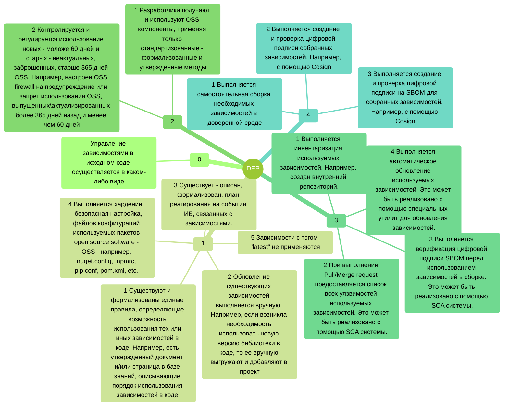
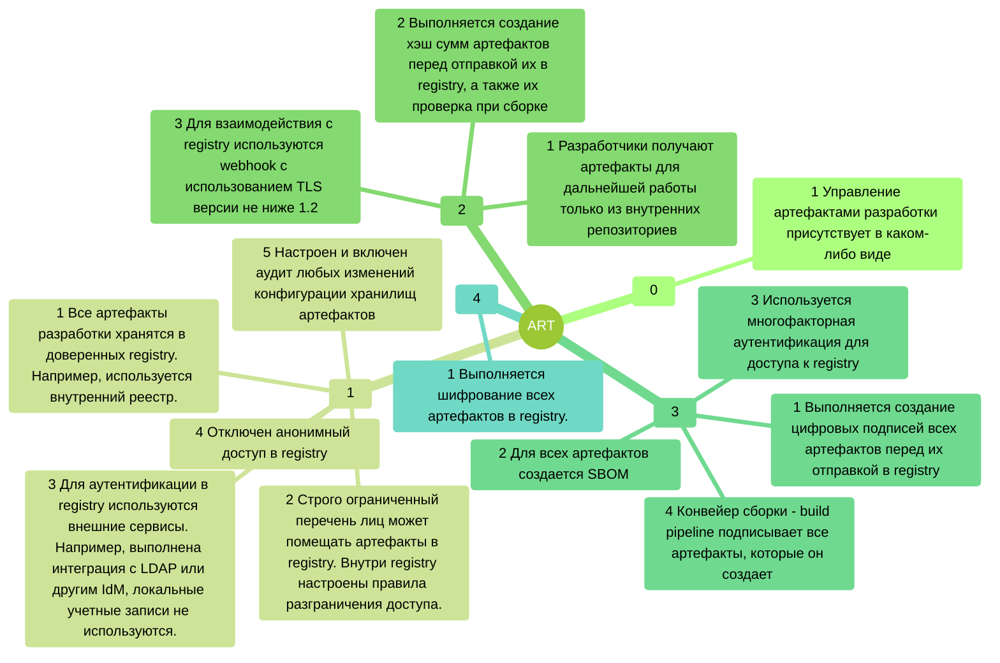
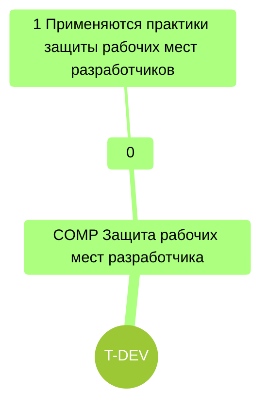

# Домен Контроль ИБ артефактов, зависимостей и образов (T-ADI)

### DEP Контроль использования сторонних компонентов

### ART Управление артефактами	

# Домен Защита окружения разработки (T-DEV)

