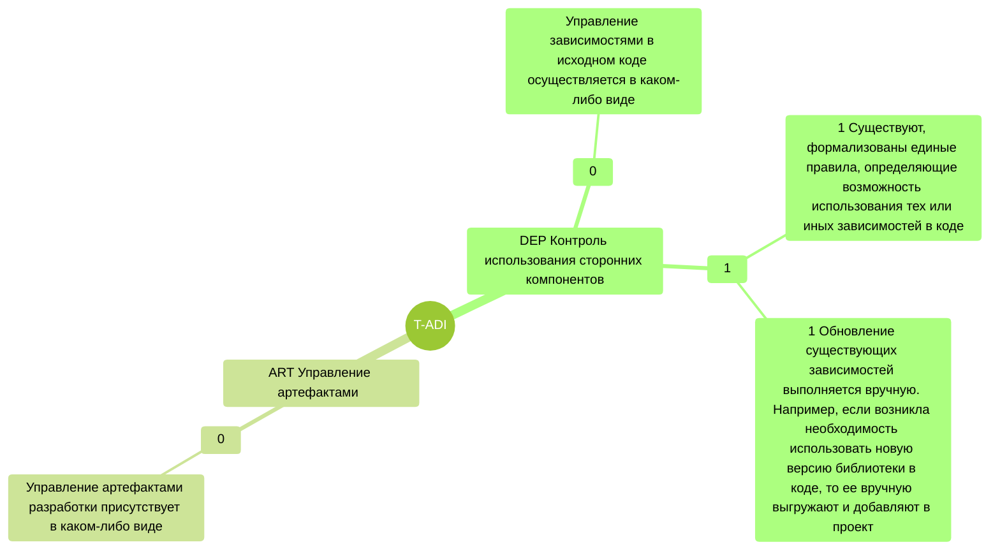
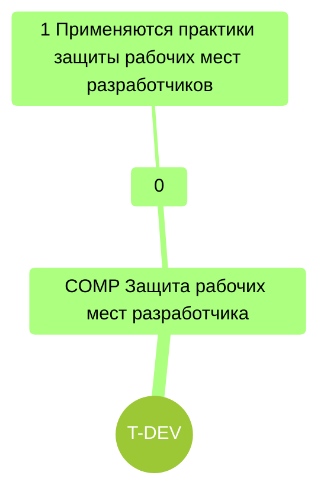

### Домен Контроль ИБ артефактов, зависимостей и образов (T-ADI)

```mermaid
%%{init: {'theme':'forest'}}%%
mindmap
  root((T-ADI))
    DEP Контроль использования сторонних компонентов
      0
        Управление зависимостями в исходном коде осуществляется в каком-либо виде
      1 
        1 Существуют, формализованы единые правила, определяющие возможность использования тех или иных зависимостей в коде
        1 Обновление существующих зависимостей выполняется вручную. Например, если возникла необходимость использовать новую версию библиотеки в коде, то ее вручную выгружают и добавляют в проект
    ART Управление артефактами	
      0
        Управление артефактами разработки присутствует в каком-либо виде
```
### Домен Защита окружения разработки (T-DEV)

```mermaid
%%{init: {'theme':'forest'}}%%
mindmap
  root((T-DEV))
    COMP Защита рабочих мест разработчика
      0
        1 Применяются практики защиты рабочих мест разработчиков
```
